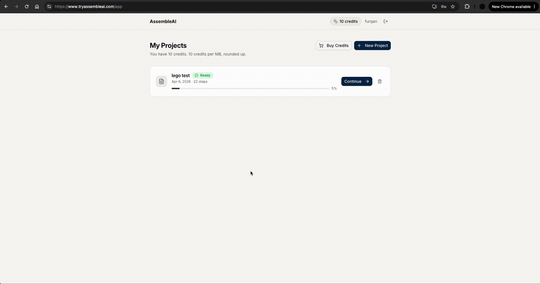

# AssembleAI

Upload a PDF instruction manual (IKEA furniture, LEGO sets, model kits) and get back clear, one-step-at-a-time assembly guidance.

Built March to April 2026. Ran in production at `tryassembleai.com` on Railway. Archived September 2026. The hosted service is shut down, so the demo below is the way to see it work.

> Reached paying customers and generated revenue through Stripe Checkout before being sunset.

---

## Demo



*Walking a real 22-step LEGO manual end to end. Every step carries its own parts list, tools, a verification check, and a citation back to the PDF pages it came from.*

---

## Why this was hard

Assembly manuals are mostly pictures. IKEA-style manuals have almost no extractable text, so a text-extraction approach returns nothing useful. AssembleAI renders every page to an image and reads the diagrams instead.

```
PDF upload
  validate        magic bytes, MIME, 50 MB cap, zip-bomb check, page limit
  charge          atomic SQL debit + ledger entry, refunded on failure
  store           S3 PutObject
  rasterize       every page to PNG at 150 DPI (pdfjs-dist + @napi-rs/canvas, concurrency 5)
  upload          page images to S3, mint presigned GET URLs (concurrency 10)
  generate        GPT-4o Vision pass 1, 20-page batches, concurrency 3
  verify          GPT-4o Vision pass 2, same images plus the draft
  save            persist steps, mark project ready
  serve           stepper UI, resumable across sessions
```

**Structured output.** Steps come back through OpenAI's `response_format: json_schema` with `strict: true` and `additionalProperties: false`. Every step is guaranteed to carry a title, substeps, parts, tools, a verification check, an optional warning, and the PDF pages it was built from.

**Two passes on purpose.** Pass 1 generates. Pass 2 sends the same page images back alongside the draft, under a prompt whose only job is deletion: strip any part, tool, quantity, or warning that is not literally visible in the diagrams. It roughly doubles token cost and latency. That is exactly why the product metered by file size.

**Page citations.** Each step records the absolute page numbers it came from and shows them in the UI as `PDF pp. 4-6`. A user who doubts a step can check the source immediately. Batching makes this harder than it looks: every batch is told its own absolute page offset so citations stay correct across the whole document instead of restarting at 1.

---

## Stack

| Layer | Choice |
|---|---|
| Frontend | React 19, TypeScript, Vite, wouter, TanStack Query, Tailwind v4, shadcn/ui on Radix |
| API | tRPC v11 with end-to-end type inference. The client imports the server's `AppRouter` type directly, so a changed procedure is a compile error in the UI, not a runtime 404 |
| Backend | Node.js and Express, helmet, express-rate-limit |
| Database | MySQL with Drizzle ORM, migrations via drizzle-kit |
| AI | OpenAI `gpt-4o` for vision and generation, `text-embedding-3-small` for embeddings |
| PDF | pdfjs-dist with @napi-rs/canvas. Pure Node, no system binaries |
| Storage | AWS S3 (SDK v3), private bucket, presigned GET URLs |
| Payments | Stripe Checkout with signature-verified webhooks |
| Auth | Custom. bcrypt, JWT via `jose` in httpOnly cookies, email verification via Resend |
| Hosting | Railway |

---

## Known limitations

- **40-page processing cap.** 
- **Embedding infrastructure is ingestion-only.** Text chunks are embedded into ChromaDB, but nothing queries them. `retrieveContext` exists and is never called. This is not a working RAG system.
- **LLM output is not re-validated application-side.** The JSON Schema is enforced at the API boundary. The server parses and casts without a second Zod pass.

---

## About this repo

This is a single commit. Development happened in a private repo, and the history was squashed before publishing to strip credentials and internal database dumps out of it.
